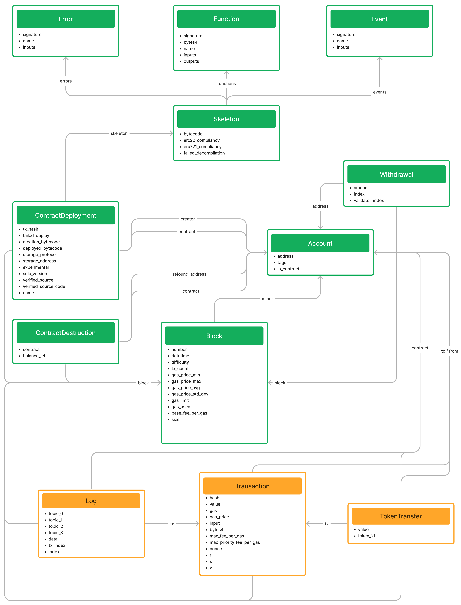

# Ethereum data to Dgraph database

This is a tool for extracting data from the Ethereum blockchain (or anh other EVM compatible chain) and index it into Dgraph, a distributed graph database.

It uses [heimdall-rs](https://github.com/Jon-Becker/heimdall-rs) to extract ABI from EVM bytecode, without relying on verified source code.

Data is extracted and stored as shown in the image below:



# How to run

To run this software you first need to install [heimdall-rs](https://github.com/Jon-Becker/heimdall-rs). To do so, follow the instructions in the README of the project.

To briefly summarize how to install heimdall, you need to install Rust and Cargo. Then, you can install heimdall using bifrost, its update and install manager, by running:

```bash
curl -L http://get.heimdall.rs | bash
```

Once you have bifrost installed and after reloading your shell, you can install heimdall by running:

```bash
bifrost
```

This will download and compile heimdall.

Once you have heimdall-rs installed, you can check that it is working by running the following command:

```bash
heimdall --version
```

If you get the version of heimdall, you are ready to run this tool. Currently, it is tested with heimdall-rs version 0.4.6.

Then, after cloning this repository, you can build the tool in release mode by running:

```bash
cargo build -r
```

or install it running 

```bash
cargo install --path .
```

You can then run the tool by running:

```bash
eth2dgraph --help
```

It has three commands:

 - `extract`: it extracts data from Ethereum endpoint to compressed JSON files, ready to be imported into Dgraph.
 - `stream`: it streams live data from Ethereum to Dgraph using websockets. It can also sync Dgraph and Ethereum in case they're not.
 - `analyse`: it can be used to calculate cosine or interface similarities between EVM skeletons. There's also the code to perform an analysis of the lifetimes of the contracts. It can be used as a reference to implement other analysis.

It's possible to run each of the command with `--help` to see the available options.

In case you want to index verified source code, you'll need to clone the [smart-contract-sanctuary-ethereum](https://github.com/tintinweb/smart-contract-sanctuary-ethereum) repo and point to it with the `-s` flag.

